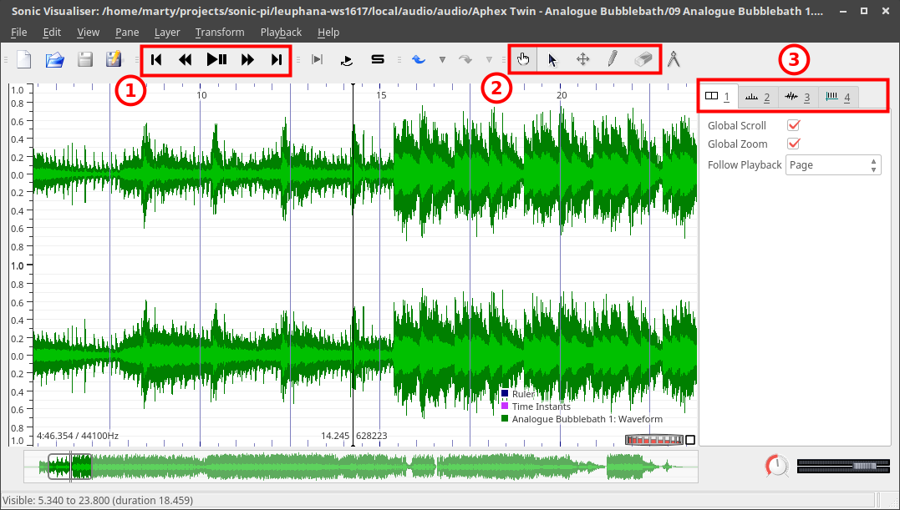
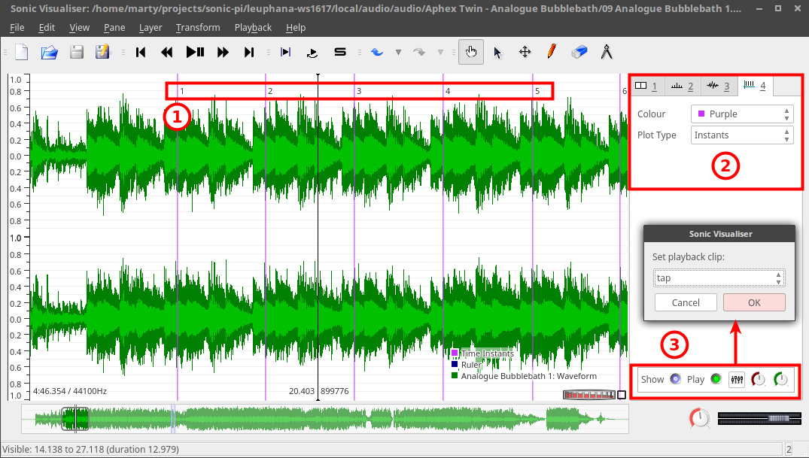
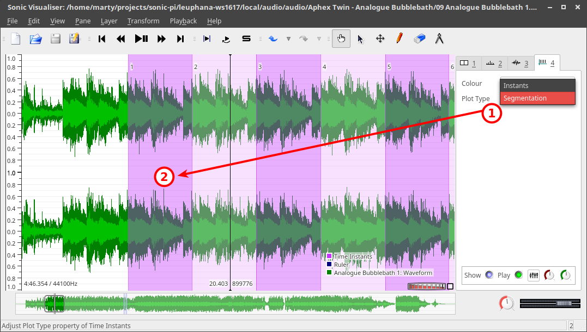
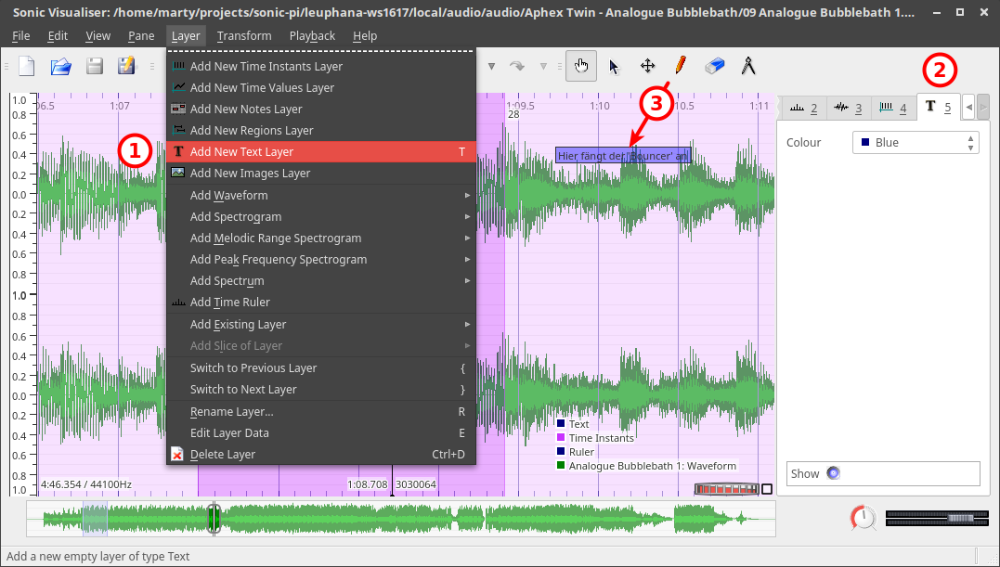
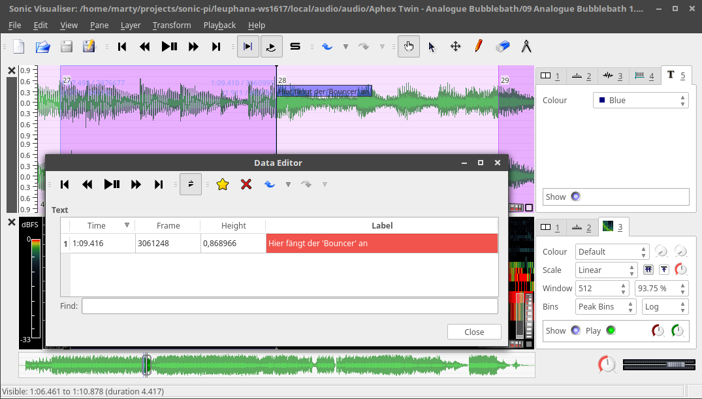
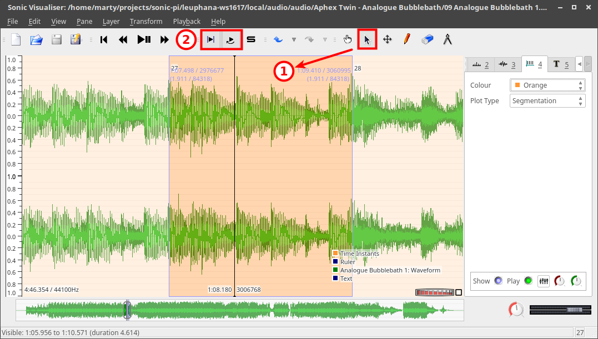
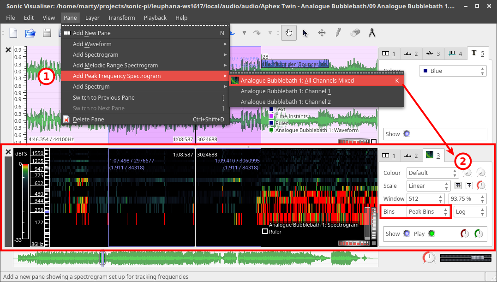
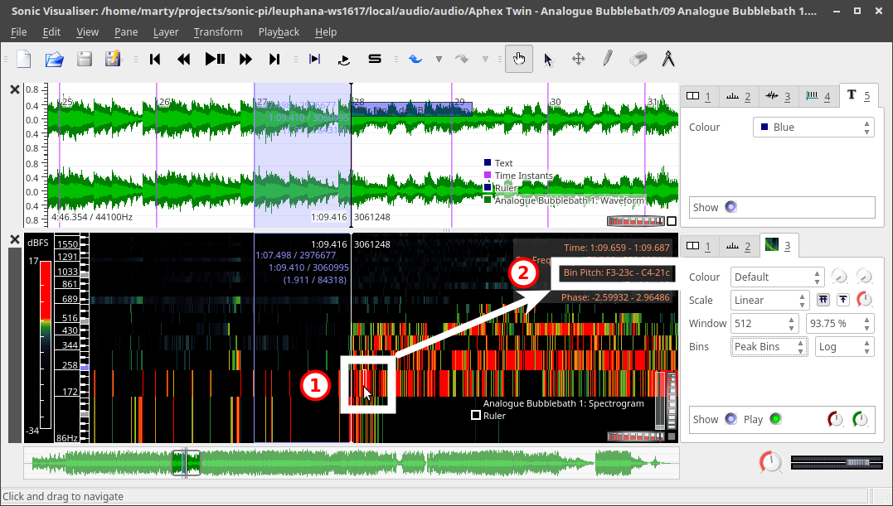
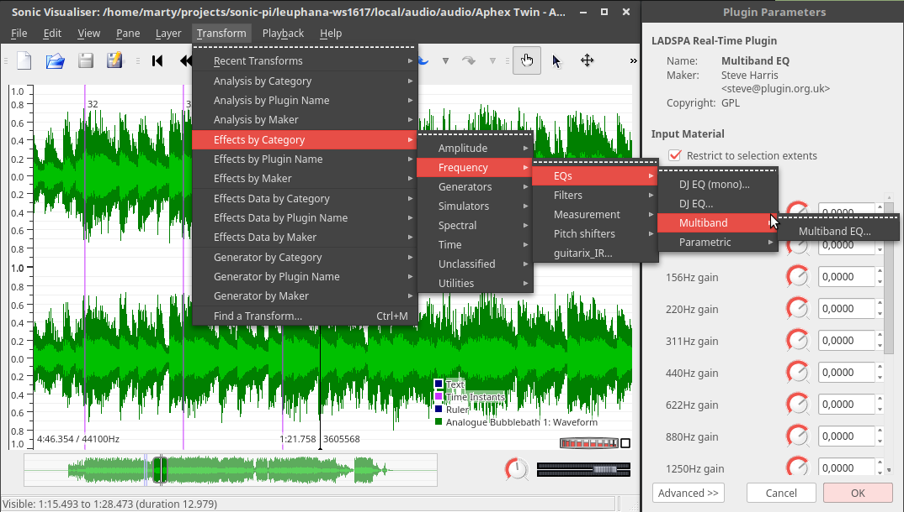

# Sonic Visualiser

Sonic Visualizer ist eine Software, mit der Klangdateien analysiert und annotiert werden können. Das Programm ist als Open Source verfügbar für Windows, OS/X und Linux.

## Download, Plugins und Hilfe

- [Homepage](http://sonicvisualiser.org/)
- [Download](http://sonicvisualiser.org/download.html)
- [Plugins](http://www.vamp-plugins.org/)
  - [Melodische und harmonische Analyse](http://www.isophonics.net/nnls-chroma)
  - [Effekte und Filter (nur Linux)](http://plugin.org.uk/download.php)
- Hilfe
  - [Dokumentation (Englisch)](http://sonicvisualiser.org/documentation.html)
  - [Videos zur Einführung](http://sonicvisualiser.org/videos.html)

## Playback, Werkzeuge und Ebenen

1. Wiedergabesteuerung
2. Werkzeuge
  - Navigation/Verschieben der Time-Line
    - Weitere Möglichkeiten:
      - Das Mausrad zoomt in die Wellenform hinein bzw. heraus
      - `Strg` plus Mausrad scrollt vor oder zurück
  - Auswahlwerkzeug
  - Verschieben (z. B. von Text)
  - Editieren (z. B. von Text)
  - Löschen (z. B. von Text)
3. Aktuelle Ebenen
  - Ebene 1: Einstellungen für alle Ebenen
  - Ebene 2: Zeitunterteilung
  - Ebene 3: Wellenform
  - Ebene 4: Einteilung in Abschnitte (manuell hinzugefügt)

## Sequenzierung

1. Manuell und automatisch numerierte Taktmarkierungen (mit `Enter` oder `;`)
2. Jede Ebene (hier die Taktmarkierungen) bietet eigene Einstellungen (für aktuelle Ebene sind das die Farbe und der Ansichtsmodus)
3. Die Taktmarkierungen können mit einem rhythmischen Klang hörbar gemacht werden; man kann sie ausblenden oder stummschalten sowie Lautstärke und Position im Stereo-Panorama regeln

1. Die Ebene mit den Takteinteilung im Modus `Segmentation` und in violett eingefärbt
2. Die Takte werden wechselseitig hell bzw. dunkler gekennzeichnet

## Annotation

1. Hinzufügen einer Textebene
2. Die Textebene wird blau eingefärbt
3. Textlabels können mit dem Stift eingefügt, mit dem Kreuz verschoben und mit dem Radierer gelöscht werden.

- Wenn eine Ebene Text enthalten kann (in der Ansicht z. B. Ebene 4 und 5) und angewählt ist, 
- dann wird mit der Taste `e` ein Editor eingeblendet. Man kann damit die Markierungen ändern und durch Anklicken auch hin-und-her-springen.

## Auswahl und Looping

1. Mit dem Auswahlwerkzeug kann man den Bereich zwischen zwei Markierungen durch Anklicken auswählen (hier z. B. einen Takt).
2. Mit angewählter Taste `nur Auswahl wiedergeben` und `loopen` wird der Takt in der Wiedergabe automatisch geloopt.

## Wiedergabegeschwindigkeit

1. Mit angewählter `Auswahl`- und `Loop`-Taste kann man nun 
2. die Laufgeschwindigkeit hoch- oder herunterregeln. Dabei bleibt die Tonhöhe erhalten.
3. Auswahlen können auch exportiert werden. D. h. mit dem Sonic Visualiser kann man auch Loops zur Verwendung als Sample erstellen. (1. Auswahl erstellen; 2. `File > Export Audio File`; dann nach Angabe eines Dateinamens und Formats `Export the selected region only` auswählen.)

## Peak Frequency

1. Es gibt weitere Ansichten (ausser der Wellenform), die als neues Teilfenster (oder auch als Ebene) hinzugefügt werden können; sinnvoll ist z. B. das `Peak Frequency Spectrogram`, 
2. mit dem man sich eine grafische Darstellung der prägnantesten Frequenzen (`Peak Bins`) anzeigen lassen kann. Das Auswahlfeld `Windows` regelt die Auflösung der Darstellung; zur Analyse ist hier eher ein geringerer Wert geeignet.

1. Fährt man mit der Maus über die Frequenzbalken, 
2. bekommt man die aktuelle Tonhöhe angezeigt. Diese Analyse ist je nach Komplexität das Klangsprektrums mehr oder weniger genau.

## Equalizer

- Plugins wie z. B. Equalizer oder Filter helfen dabei, einzelne Frequenzbereiche (z. B. Bass oder Rhythmus der Hihat) zur besseren Analyse auszublenden oder zu separieren.
